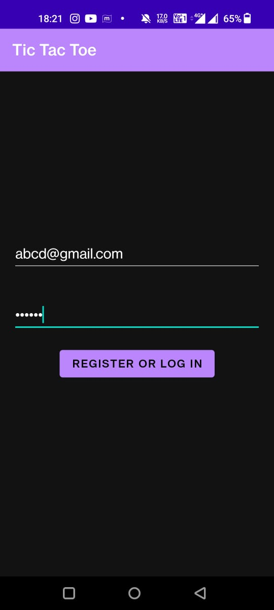
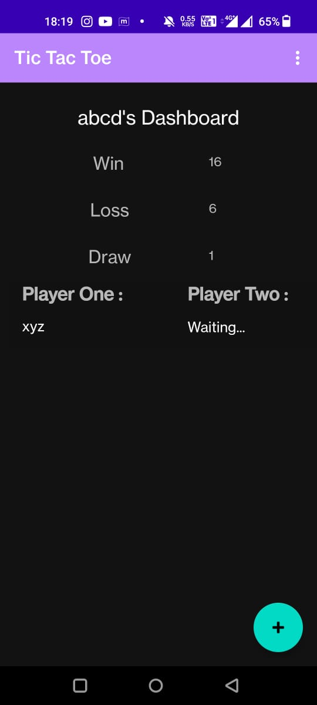
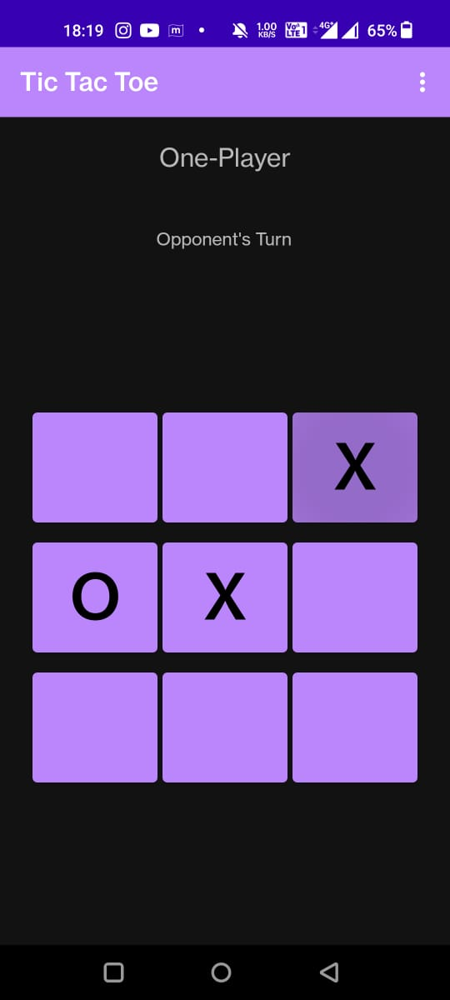

# A5-Tic Tac Toe
## Name: **Atharv Shimpi**
## BITS ID: **2020A7PS1722G**
## Email: **f20201722@goa.bits-pilani.ac.in**

## Abstract
This is a multiplayer Tic Tac Toe game, which can be played in 2 modes, viz. Single Player and Two Player. In case of :-
- Single Player, one will play against the CPU logic
- Two Player, one can either create a game and wait for someone to join OR join a game created by someone  

It uses Android Navigation Component, with a single activity and three fragments:

- **DashboardFragment** is the home screen. If a user is not logged in, it should navigate to the
  **LoginFragment**.

- The floating button in the dashboard creates a dialog that asks which type of game to create and
  passes that information to the GameFragment (using SafeArgs).

- **GameFragment** UI has a 3x3 grid of buttons. They are initialized in the starter code.
  Appropriate listeners and game play logic needs to be provided.

- Pressing the back button in the GameFragment opens a dialog that confirms if the user wants to
  forfeit the game. (See the FIXME comment in code.)

- A "log out" action bar menu is shown on both the dashboard and the game fragments. Clicking it
  should log the user out and show the LoginFragment. This click is handled in the MainActivity.

It's UI persists even if one changes the orientation of the device. It is also accessible to people using talkback.

## Description
1. Task 1 -  
   - App's entry point is the dashboard fragment, so if user is not logged in, the user will be re-directed to login screen. 
   - Login or register new user is done with the help of firebase authentication. 
   - If the emailID entered exists in firebase then user will be logged in, else new user will be registered. 
   - User is directed to Dashboard fragment and Login screen is removed from stack. 
   - Each fragment has log out button in menu, clicking which will redirect user to login screen.

2. Task 2 -
   - Both single player and multiplayer are implemented using the firebase to avoid different codes for single and multiplayer game. 
   - The app will check for winning combinations after every move. 
   - If the user win/loss/draw then dialog box will appear and the dashboard stats will change accordingly. 
   - As the game's logic need not be smart, the cpu will mark at the first available box.

3. Task 3 -  
   - Game is implemented using Firebase Realtime Database. 
   - The game created by a user will be visible to other users in dashboard. 
   - The user who created the game will wait until another user selects that game from dashboard. 
   - First turn will be user who created the game. 
   - The app will check for winning combinations after every move by either user. 
   - If the user forfeits, a dialog box will appear and the user who forfeited will lose and opponent will win.

## Some Bugs
1. If two people click on the same game simultaneously in lobby, both are able to join it.
2. If logout is clicked anywhere apart from the dashboard, it doesn't logout.  
3. Loader must be present to indicate the user about the current situation of login.  
4. Upon rotating the app whilst in between a game, crashes it.

## Game Mechanics
1. I implemented sign in/sign up using Firebase Authentication with email and password. It check if the user already has an account or not, if not then it creates one, else it signs him up.
2. Whenever a new User is created, that user is being also stored in the Real Time Database with the fields Win count, Loss count and Draw count initialized to 0.
3. Whenever the User creates a new two player game, then a new "Available Games" object is created in database with unique random game UUID.
4. As and when the Second Player joins the available game, then a new "Running Game" object is created in database with the same Game ID as that of the clicked "Available Game" and this time both the users are stored in the newly created "Running Games" object.
5. Whenever there is any change in the above object, then that object is reloaded and the game state in both the player's game is changed.
6. After the game is finished the user stats is changed for that users.

## Some Screenshots
 
 

## Accessibility
1. **Talkback** :-

I ran the app with a blindfold, via the Talkback feature. Overall, the app's experience was decent.
We have to wait for a few seconds before the authentication, as in the case of weak network it might take time (can implement some kind of audio playing every 10s to indicate that auth is still not complete). The floatingButton was the toughest to access as it kept selecting the item (in game lobby) next to it.

2. **Accessibility Scanner** :-

         Suggestions :-

        1.Item Descriptions - This item's height is 45dp. Consider making the height of this touch target 48dp or larger.
        2.Insufficient Image Color Contrast Ratio - The image's contrast ratio is 1.77. This ratio is based on an estimated foreground color of #FFFFFF and an estimated background color of #03DAC5.
        3.No Speakable Text Present - This item may not have a label readable by screen readers.
        4.Text Scaling - The TextView has a fixed size and scalable text.  
        5.Text Scaling - This ViewGroup has a fixed height and contains a TextView with scalable text.  

         Modification :-

        1.Set this item's android:minHeight to 48dp
        2.Consider increasing this ratio to 3.00 or greater.
        3.Set this item's android:contentDescription to a meaningful non-empty string or resource reference. 
        4.Changing the textSize to '48sp'.

## Testing
1. **Unit Testing** :-

2. **Instrumented Testing** :-

## Total Time taken for Completion
40 hrs

## Assignment Difficulty
10/10

## Attributes
I was also helped in most part of game logic by Shobhit Gangwal (2020A7PS1703G) & Raghav Kumar (2020A7PS1700G)